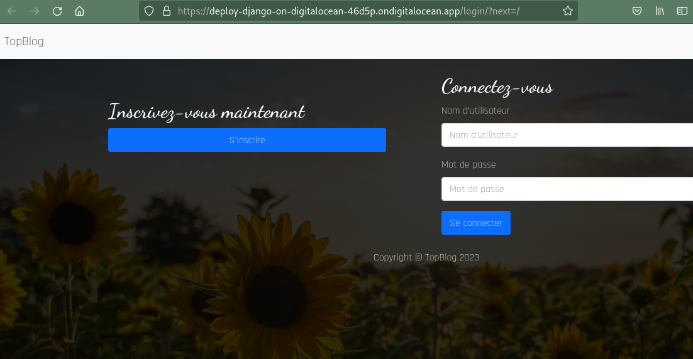

# Deploy Django on Digital Ocean

## Project description
Last update: **2023/09/08**

I lost precious time just trying to deploy a Django app here..,

Learning and training purposes.

We dynamically deploy a dummy Django application on [DigitalOcean App platform](https://www.digitalocean.com/products/app-platform).

We do not create a Virtual machine.

First objective is to be able to deploy a Django application on DigitalOcean: have a basic usage of the postgresql database, check the static files collect.

An upload feature should be implemented.

Finally it can be use through Gitlab for CI/CD trainings.

## Documentation

Official docs:

[Digital Ocean tutorial](https://docs.digitalocean.com/developer-center/deploy-a-django-app-on-app-platform/)

[Digital Ocean Django sample app repo](https://github.com/digitalocean/sample-django)

[Digital Ocean Python's Buildpacks](https://docs.digitalocean.com/products/app-platform/reference/buildpacks/python/)

[Hashicorp tutorial for DigitalOcean provider](https://developer.hashicorp.com/terraform/tutorials/applications/digitalocean-provider)

## Ressources

Background image from unsplash: https://unsplash.com/photos/8bEMXJ_NwF4

Miniatures images from picum: https://picsum.photos/

---

## Project setup

To deploy we can use either DigitalOcean API or the DigitalOcean client (doctl).

Test has been done with the doctl, to install the doctl client : [Install DOCTL](https://docs.digitalocean.com/reference/doctl/how-to/install/)

The doctl client will read specifications in your local .do/app.yaml. It becomes a templated file which won't be upload to the git repo.

[Discover all the doctl command references](https://docs.digitalocean.com/reference/doctl/reference/)

On Linux, the default configuration file of the doctl client is: "/home/[username]/.config/doctl/config.yaml".

Compare to the sample-django project few modifications have been made :

- use the ".do/app.j2" file to declare any variables, then we'll generate the yaml file declaring credentials through command line.

- notice the Postgresql version 12 (13, 14 and 15 unauthorized).

- settings.py: check if timezone settings are the ones you need.

---

## Run the project

**Setup the app.yaml**: python ./doctl_setup.py -l donald -p @pplepie94 -e donald@some_bluelake.fr

**Deploy**:  doctl apps create --spec .do/app.yaml

**Follow deployment**: doctl apps list --output json

**Destroy application after**: doctl apps delete [app id]

---
